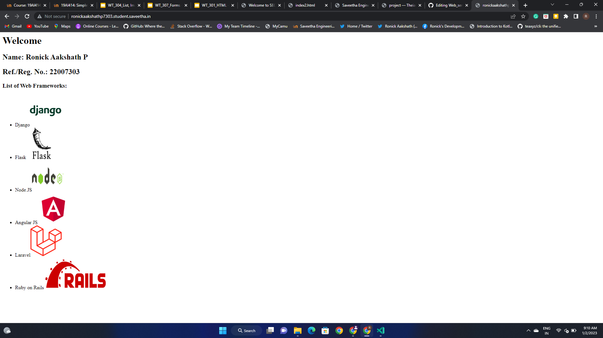

# Developing a Simple Webserver

# AIM:

Name: Ronick Aakshath P; Ref./Reg. No.: 22007303

# DESIGN STEPS:

## Step 1:

HTML content creation is done

## Step 2:

Design of webserver workflow

## Step 3:

Implementation using Python code

## Step 4:

Serving the HTML pages.

## Step 5:

Testing the webserver

# PROGRAM:
```
from http.server import HTTPServer, BaseHTTPRequestHandler

content = """
<html>
<head>
</head>
<body>
<h1>Welcome</h1>
<h2>Name: Ronick Aakshath P</h2>
<h2>Ref./Reg. No.: 22007303</h2>
<h3>List of Web Frameworks:</h3>
<ul>
<li>Django</li>
<li>Flask</li>
<li>Node.JS</li>
<li>Angular JS</li>
<li>Laravel</li>
<li>Ruby on Rails</li>
</ul>
</body>
</html>
"""

class HelloHandler(BaseHTTPRequestHandler):
    def do_GET(self):
        self.send_response(200)
        self.send_header('Content-type', 'text/html; charset=utf-8')
        self.end_headers()
        self.wfile.write(content.encode())

server_address = ('', 80)
httpd = HTTPServer(server_address, HelloHandler)
httpd.serve_forever()
```

# OUTPUT:

# RESULT:

The program is executed succesfully
